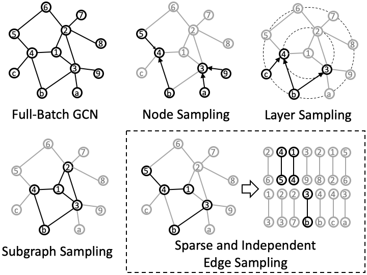

# Edge Convolutional Network (ECN)

This repo contains code that are required to reporduce all experiments in our paper *Edge Convolutional Networks: Decomposing Graph Convolutional Networks for Stochastic Training With Independent Edges*.

## Paper Abstract



After the success of Graph Convolutional Network (GCN), many stochastic training methods have been proposed to resolve the scalability and efficiency issues of GCN by sampling.
In mini-batch training, a common phase of these methods is to form a small-scale subgraph rooting in the given batch.
The subgraph formation leads to heavy time consumption, additional space occupation, and complex implementation.
To rectify these issues, we eliminate the subgraph formation phase and propose Edge Convolutional Network (ECN), which is trained with independently sampled edges.
It has constant time complexity for sampling, reducing the sampling time by orders of magnitude without compromising convergence speed.
Specifically, when there are two convolutional layers, as in the most common situation, GCN can also be trained with the techniques behind ECN, gaining substantial sampling time reduction without trade-offs.
We prove that the expressiveness difference between ECN and GCN is theoretically bounded and examine the inference performance of ECN through excessive experiments on real-world, large-scale graphs.
Furthermore, we improve ECN with advanced mechanisms of GCN, including skip connection, identity mapping, embedding, and attention.
With proper mechanisms integrated, ECN rivals state-of-the-art (SotA) baselines in inductive node classification and produces new SotA accuracy of 51.55% on the dataset of Flickr.

## Usage

```bash
usage: node.py [-h] [--hidden HIDDEN] [--batch-size BATCH_SIZE] [--runs RUNS]
               [--gpu GPU] [--lr LR] [--dropout DROPOUT]
               [--weight-decay WEIGHT_DECAY] [--symmetric] [--transductive]
               [--semi-supervised] [--early-stop-iters EARLY_STOP_ITERS]
               [--early-stop-epochs EARLY_STOP_EPOCHS]
               [--max-epochs MAX_EPOCHS] [--precompute PRECOMPUTE]
               [--skip-connection] [--embedding EMBEDDING]
               [--attention ATTENTION] [--no-importance-sampling]
               [--middle-layers MIDDLE_LAYERS]
               method dataset

positional arguments:
  method                MLP | GCN | GraphSAGE | FastGCN | GraphSAINT | ECN
  dataset               cora | citeseer | pubmed | flickr | ppi | arxiv | yelp | reddit

optional arguments:
  -h, --help            show this help message and exit
  --hidden HIDDEN       Dimension of hidden representations. Default: auto
  --batch-size BATCH_SIZE
                        Default: auto
  --runs RUNS
  --gpu GPU
  --lr LR               Learning Rate
  --dropout DROPOUT
  --weight-decay WEIGHT_DECAY
  --symmetric           Symmetrically normalized adjacency matrix
  --transductive        Access graph nodes of the test set in training phase
  --semi-supervised     Only available for cora, citeseer and pubmed. Default: full supervised
  --early-stop-iters EARLY_STOP_ITERS
                        Maximum number of iterations for performance decline to stop
  --early-stop-epochs EARLY_STOP_EPOCHS
                        Maximum number of epochs for performance decline to stop
  --max-epochs MAX_EPOCHS
                        Maximum number of epochs before early stop
  --precompute PRECOMPUTE
                        Times to transform features with normalized adjacency matrix. Default: auto
  --skip-connection     Enable skip connections for all layers
  --embedding EMBEDDING
                        Scale the effect of regularization for layer1 with GAE
  --attention ATTENTION
                        Number of attention heads for layer2
  --no-importance-sampling
                        Disable importance sampling. Sample uniformly
  --middle-layers MIDDLE_LAYERS
                        Number of layers between layer1 and layer2. Default: precompute - 1
```

Dataset Reddit is so large that `node.py` raises out-of-memory exception when evaluating, so we provide another modified script `node-reddit.py` with argument `--gpu2 GPU2` to use a second GPU card for evaluation.

## Reproducibility

Files in `scripts/` folder are scripts that run experiments and parse logfiles.

* `search_arch` runs experiments of ablation study, producing data for Table 3 and Table 5 in our paper.
* `compare_baselines` runs experiments of speed comparation, producing data for Figure 5 and Figure 6 in our paper.
* `late_stop` runs experiments of accuracy comparation, producing data of ECN for Table 4 in our paper.

## Datasets

All datasets used in our paper, including Cora, Citeseer, Pubmed, Flickr, PPI, ogbn-arxiv, Yelp, and Reddit, are retrieved with [DGL](https://github.com/dmlc/dgl), [PyG](https://github.com/pyg-team/pytorch_geometric), and [OGB](https://github.com/snap-stanford/ogb).

## Baselines

We implement [GraphSAGE](https://github.com/williamleif/graphsage-simple), [FastGCN](https://github.com/matenure/FastGCN) and [GraphSAINT](https://github.com/GraphSAINT/GraphSAINT) by our own with pure [PyTorch](https://github.com/pytorch/pytorch) to fairly compare the sampling time.
Our implementations leverage CSR-formatted adjacency matrices to index neighbourhoods; thus, they are more memory-saving and can handle larger graphs in our environment than the official versions of GraphSAGE and FastGCN.
Nevertheless, our version of GraphSAINT serves only for research purposes because it is much slower than the official one due to the deprecation of precompilation and multi-core processing.

Details of our implementations compared with the official versions are listed below.

### GraphSAGE

1. In the official version, a list of sets in Python has been constructed to index adjacent nodes.
It occupies huge memory when the scale of the graph increases.
We use the CSR-formatted matrix in PyTorch as an index which is more memory-saving.
2. The official implementation samples adjacency nodes without replacement.
We sample adjacency nodes with replacement in parallel.
3. The activator after a GraphSAGE layer is to normalize the layer output.
We implement it with LeakyReLU to align it with other methods.
4. The aggregator we choose is MEAN for simplicity.

### FastGCN

In the article on FastGCN, sampled nodes are not guaranteed to be connected with nodes in the previous layers.
To avoid this issue of sparse connections, which deteriorates the training, the official implementation samples nodes only in the receptive field as a compromise.
We adopt this exact implementation in our work.

### GraphSAINT

The official implementation constructs all 200 (the number of epochs) subgraphs in the preprocessing phase to leverage a precompilation technique (Cython) and multi-core processing to accelerate the sampling vastly.
Furthermore, the sampled 200 subgraphs are used to estimate the two required normalization coefficients before training.
To save the wasted subgraphs when early stopping is adopted and to compare different sampling methods fairly, we implement subgraph sampling with pure PyTorch and sample one subgraph for training in every iteration.
The estimations of two normalization coefficients are updated every time a new subgraph is sampled.

## Citation

```bibtex
@article{LUO2023126430,
    title = {Edge Convolutional Networks: Decomposing Graph Convolutional Networks for Stochastic Training with Independent Edges},
    journal = {Neurocomputing},
    pages = {126430},
    year = {2023},
    issn = {0925-2312},
    doi = {https://doi.org/10.1016/j.neucom.2023.126430},
    url = {https://www.sciencedirect.com/science/article/pii/S0925231223005532},
    author = {Yi Luo and Yan Huang and Guangchun Luo and Ke Qin and Aiguo Chen},
    keywords = {Graph Convolutional Network, Stochastic Training, Sampling, Attention}
}
```
